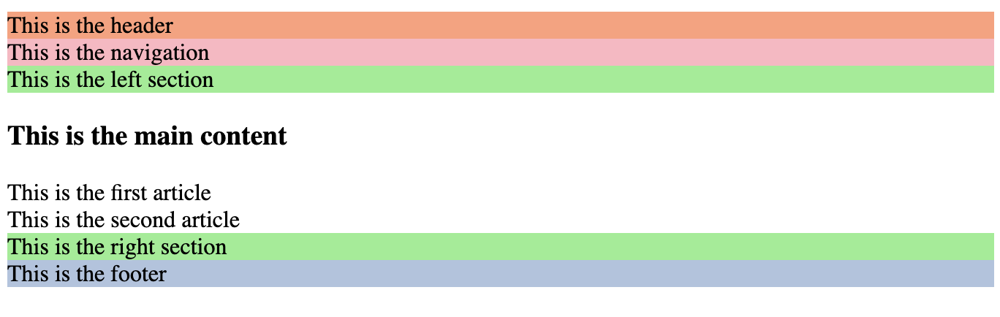

# Huhuu-dev day 2

## Error handling

- Update `server.js` so it can handle errors when a page that does not exist is requested:

```js
fs.readFile("."+req.url, function(err, data){
  if (err) {
    if (err.code === 'ENOENT') {
        res.writeHead(404, { 'Content-Type': 'text/html; charset=UTF-8' });
        res.end("Page not found");
    } else {
        res.writeHead(500, { 'Content-Type': 'text/html; charset=UTF-8' });
        res.end(err);
    }
  } else {
    res.writeHead(200, { 'Content-Type': 'text/html; charset=UTF-8' });
    res.end(data);
  }
});
```

- Update `server.js` so we can configure the port:

```js
const port = process.env.PORT || 8080
server.listen(port)
console.log(`server listening on port ${port}`)
```

- move all the html files to a `public` folder and teh server to a `src` folder, so it looks like this

```shell
├── public
│   ├── index.html
│   ├── me.html
│   └── test.html
└── src
    └── server.js

```

Remember to update `server.js` to read files from `/public` now

- Make sure that everything works fine by restarting the server `PORT=8080 node src/server.js`

## HTML elements, styling and positioning

### Basic web page structure


- Add these elements to `public/index.html`, inside the `<body>` tags

```html
<header>
  This is the header
</header>
<nav>
  This is the navigation
</nav>
<main>
  <section class="left-section">
    This is the left section
  </section>
  
  <section>
    <h3>This is the main content</h3>
    <article> This is the first article</article>
    <article> This is the second article</article>
  </section>
  
  <section class="right-section">
    This is the right section
  </section>
</main>
<footer>
  This is the footer
</footer>
```

Should look like this


- Let's add some background color to each block. We are going to use CSS to style the HTML.
  - Add these `<style></style>` tags to the index.html, inside the `<head>` tags

  ```html
  <!DOCTYPE html>
  <html lang="en-US">
    <head>
      etc.
      <style>
      </style>
    </head>
    etc.
  ```

  - To style an HTML element we can use the [Type selector](<https://developer.mozilla.org/en-US/docs/Web/CSS/Type_selectors>). For example, to add background color to the header, we will write this:

  ```html
  <style>
    /* All <header> elements get this background color. */
    header {
      background-color: lightsalmon;
    }
  </style>
  ```
  
  Now, add styles for all of them: `<header>`, `<nav>`, `<section>`, `<footer>`

  - To style the same HTML element in a different way, we can use the [Class selector](<https://developer.mozilla.org/en-US/docs/Web/CSS/Class_selectors>).

    Assign a class attribute to each section:

    ```html
    <section class="left-section">
      This is the left section
    </section>
    <section class="right-section">
      This is the right section
    </section>
    ```

    Define the style for each class inside the `<style></style>`

    ```css
    .left-section {
      background-color: lightgreen;
    }
    .right-section {
      background-color: lightgreen;
    }
    ```

    This can also be written as: (note the comma as separator)

    ```css
    .left-section, .right-section {
      background-color: lightgreen;
    }
    ```

    The page should look like this:
    

- Let's position the elements with the `position` [CSS property](<https://developer.mozilla.org/en-US/docs/Web/CSS/position>)
  Send the footer to the bottom of the page

  ```css
  footer {
    background-color: lightsteelblue;
    position: fixed;
    bottom: 0;
  }
  ```

- And let's add some `border` so we can see better where each block starts and ends
  
  ```css
  /* * targets all elements in the document */
  * {
      border: 2px solid black;
    }
  ```

### Positioning things

- Layout

Flow layout <https://developer.mozilla.org/en-US/docs/Web/CSS/CSS_Flow_Layout/Block_and_Inline_Layout_in_Normal_Flow>

- Position
<https://developer.mozilla.org/en-US/docs/Web/CSS/positio

- Open [boxes.html](../day-2/baseline/public/boxes.html) in your editor and browser; let's move things around!
 